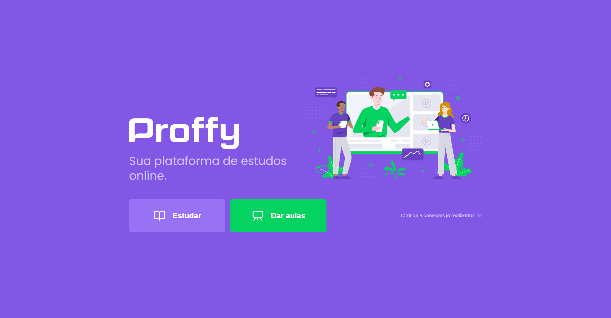

## Resumo da aplicação desenvolvida

- A aplicação foi desenvolvida com o foco no ensino, que funciona da seguinte forma, a plataforma tem uma tela exclusivamente para os professores, para que eles possam informar seus dados para se cadastrar, é obrigatório informar seu nome completo, disciplina que ele ensinará, o custo da sua hora/aula, sua biografia, os horários disponíveis e o seu whatsapp para que alunos interessados possa entrar em contato. Já os alunos terá uma tela para filtrar as disciplinas e seu horário que deseja ter aula.

## JavaScript (NodeJS, ReactJS, React Native)

- Todo o projeto foi desenvolvido utilizando a linguagem javascript, com nodejs no backend, reactjs no frontend-web e react native no frontend-mobile.

## Home da aplicação

## Agradecimentos

- Todo meu agradecimento vai a empresa Rocketseat que disponibiliza conteúdos gratuitos com ótima qualidade, inclusive este projeto foi desenvolvido durante uma semana que eles disponibiliza de graça com video todos os dias durante uma semana.
